# 🧁 SweetControl - Sistema de Gestão para Confeitaria

O **SweetControl** é uma plataforma integrada para microempreendedores do ramo de confeitaria artesanal. O sistema é composto por uma API robusta e um aplicativo móvel focado em usabilidade e funcionamento offline-first.

Atenção!!! A grade expertise do **offline-first** neste projeto e que o usuario depois que logou pela primeira vez, **mesmo que fique sem internet podera desfrutar de todas as funcionalidades do App** indepednete da cloud (Backend na hospedagem).

## 📱 Interface do Usuário (UI)

O design do SweetControl foi pensado para ser limpo e intuitivo, utilizando a paleta de cores institucional (multiplos temas) para transmitir confiança e organização.

### 📸 Demonstração das Telas

| Login | Criar Conta | Tela Pos Login Caixa |
| :---: | :---: | :---: |
| 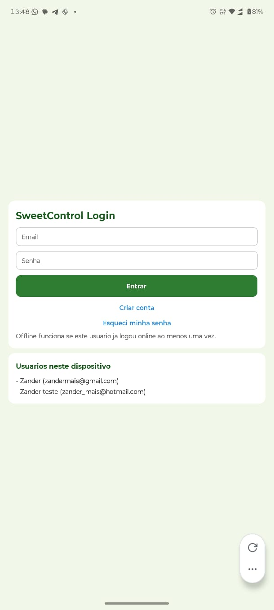 | 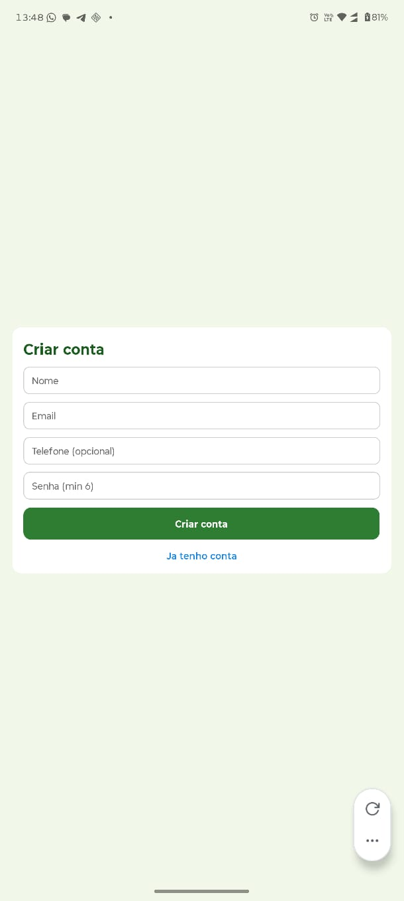 | 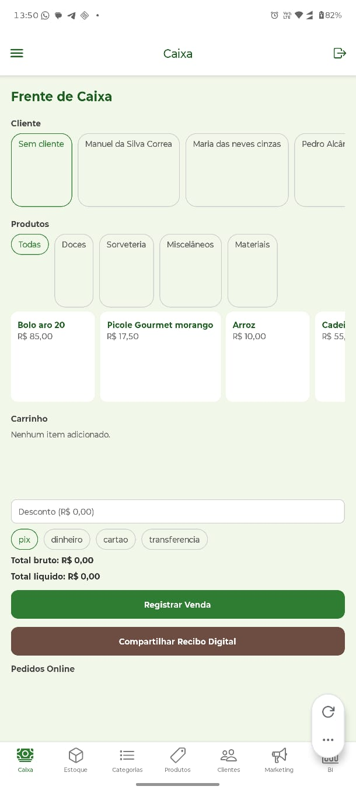 |
| *Visão das contas registrada no device.* | *Criar Conta do zero.* | *tela inicial Frente de Caixa.* |

| Cadastro de Categoria | Cadastrar Produtos | Cadastrar Clientes (opcional) |
| :---: | :---: | :---: |
| 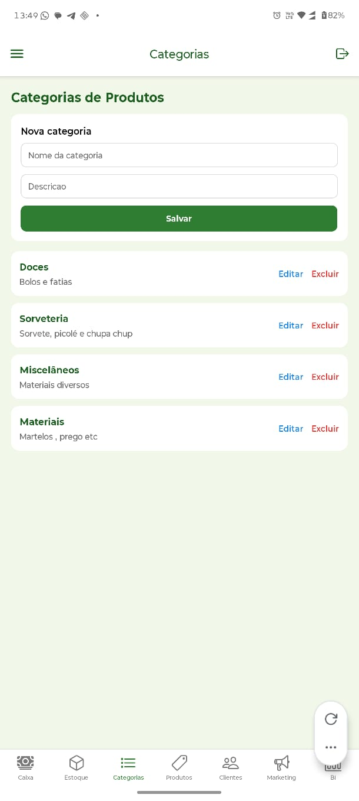 | 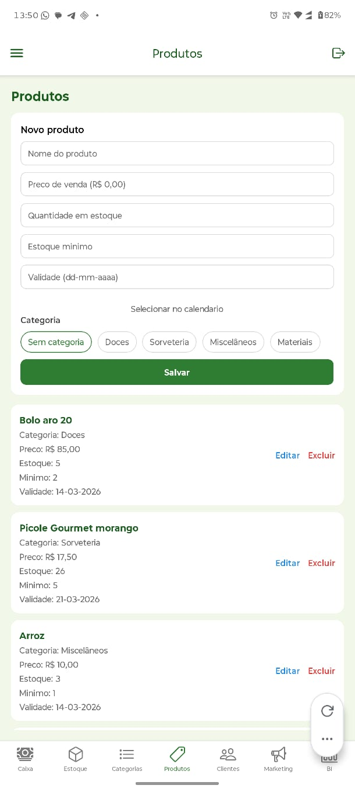 | 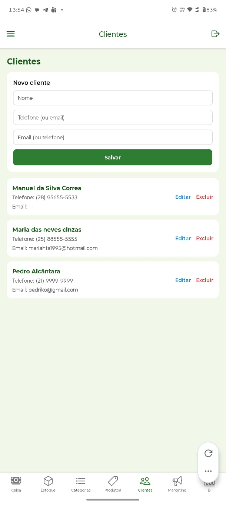 |
| *Area de Cadastro das categorias.* | *Casdastro dos produtos.* | *Registros dos clientes para colocoar nos recebos.* |

| Tela de Recebibo na frente de caixa | Markenting | Financeiro (BI) |
| :---: | :---: | :---: |
| 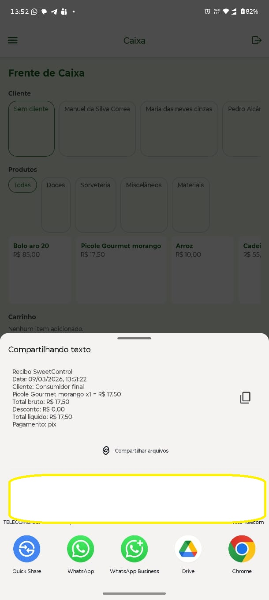 | 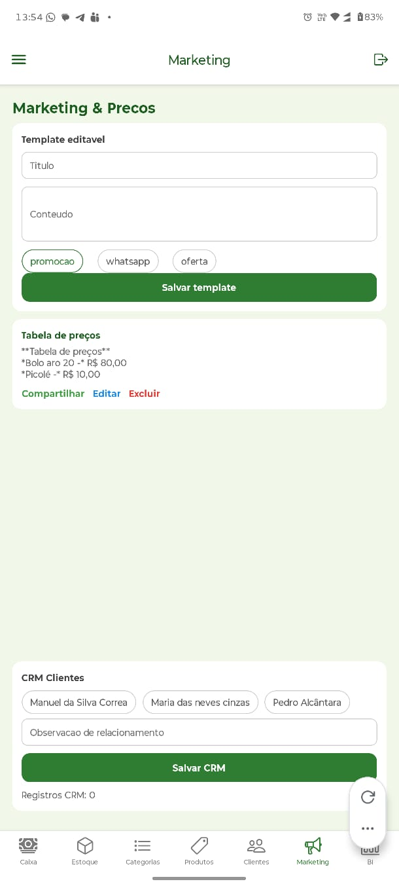 | 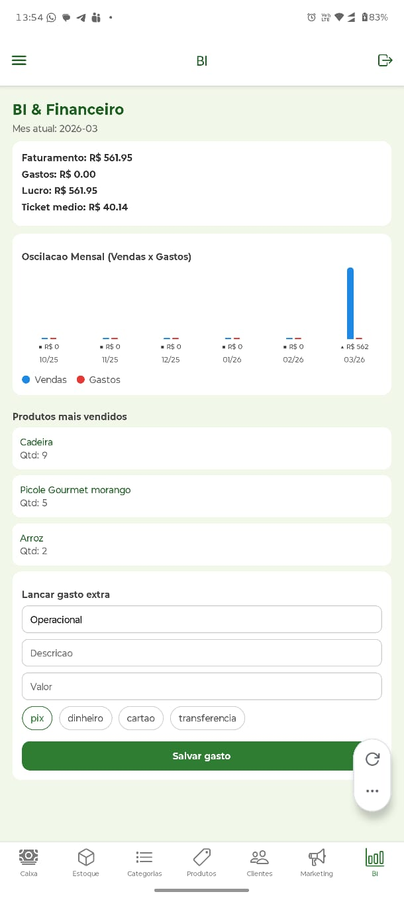 |
| *Apos registrar venda, acione borão compartilhar recibo.* | *Tempalte para ser compartilhado no whatsapp.* | *Controle Financeiro (BI).* |

| Menu de Configurações |
| :---: | 
| 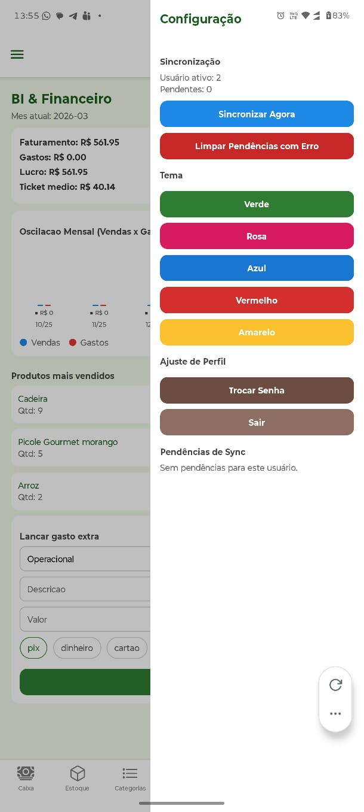 |
| *Ajustar Tema, sicronizar manualmente e acompanhar sicronizações em andamento | 

> **Nota:** As imagens acima são ilustrativas do ambiente de homologação. O layout adapta-se automaticamente a diferentes tamanhos de tela de dispositivos Android.

## 📲 Download e Instalação (Mobile)

Para testar a solução em ambiente real ou emulativo, os artefatos nativos foram compilados e estão disponíveis nos links abaixo.

### 📥 Links de Acesso

| Plataforma | Artefato | Destino | Link de Download |
| :--- | :--- | :--- | :--- |
| **Android** | `.apk` | Smartphone Real | [**📥 Baixar SweetControl.apk**](https://expo.dev/artifacts/eas/s2ZqZfGDPu9E6pasScGg8P.apk) |
| **iOS** | `.tar.gz` | Simulador macOS | [**📥 Baixar SweetControl.app**](https://expo.dev/artifacts/eas/6NVvrdiqg5roiD8nhr7tCe.tar.gz) |

---

### 🛠️ Instruções de Instalação

#### Para Android (Ficheiro APK):
1. Aceda ao link acima através do seu smartphone Android.
2. Após o download, abra o ficheiro `.apk`.
3. Autorize a "Instalação de fontes desconhecidas" nas definições do sistema.
4. O **SweetControl** será instalado na sua lista de aplicações.

#### Para iOS (Simulador):
1. Descarregue o ficheiro `.tar.gz` num computador com macOS.
2. Descompacte o ficheiro para obter o executável `.app`.
3. Abra o **Simulator** do Xcode.
4. Arraste e solte o ficheiro `.app` para dentro da janela do simulador para instalar.

---

> **Nota de Sincronização:** Ambas as versões estão configuradas para comunicar com o servidor **HostGator**. A lógica de persistência local (Redux Persist) permite que os dados sejam visualizados mesmo sem conexão, sincronizando automaticamente ao detetar rede.
## 🏗️ Estrutura do Projeto

Abaixo está a organização dos principais diretórios do ecossistema, mapeados para facilitar a manutenção e o deploy:

```text
.
├── 🌐 backend/               # Servidor PHP 8.2 (Hospedado na HostGator)
│   ├── api/                  # Endpoints REST da aplicação
│   │   ├── auth/             # Gestão de login, registro e recuperação
│   │   ├── estoque/          # Movimentações e controle de insumos
│   │   ├── produtos/         # CRUD de dos produtos
│   │   ├── vendas/           # Registro de pedidos e faturamento
│   │   └── crm/              # Gestão de clientes e histórico
│   └── config.php            # Configurações de conexão MySQL
│
├── 📱 mobile/                # Aplicativo React Native (Expo)
│   ├── app/                  # Estrutura de rotas (Expo Router)
│   │   ├── (tabs)/           # Telas principais (Vendas, Estoque, Clientes, BI)
│   │   ├── login.tsx         # Tela de autenticação
│   │   └── _layout.tsx       # Provider do Redux e Temas Dinâmicos
│   ├── assets/               # Imagens (opcional)
│   └── src/                  # Lógica de negócio e estado global
│       ├── api/              # Services e instâncias do Axios
│       └── store/            # Redux Toolkit, Slices e SyncService
│
├── 🗄️ database/              # Scripts SQL (database.sql) para ser importado na sua hospedagem
│
└── 📑 docs/                  # Documentação técnica e evidências
    ├── Arquitetura.png       # Diagrama de blocos do sistema
    └── modelagem_db.png      # Diagrama Entidade-Relacionamento
```

## 🛠️ Tecnologias & Bibliotecas

### Stack Base
- Mobile: React Native (Expo), TypeScript.
- Backend: PHP 8.2 (Arquitetura REST).
- Banco de Dados: MySQL (Conforme sua Hospedagem).
- Levantamento de Requisitos: Google Forms.

### Principais Dependências (Mobile)
- Expo Router: Navegação nativa baseada em arquivos e abas.
- Redux Toolkit: Gerenciamento de estado global e lógica de negócio.
- Redux Persist: Persistência local de dados (Funcionamento Offline).
- Axios: Comunicação com a API PHP remota.
- Jest: Testes unitários de serviços e sincronização.

## 💡 Por que esta estrutura?

* Backend Centralizado: Garante que os dados da usuária estejam seguros e acessíveis de qualquer dispositivo via Cloud(Hospedagem).
* Interface Intuitiva: O uso de (tabs) organiza as funções críticas (Estoque, Caixa, BI) para acesso rápido durante a produção.
* Resiliência (SyncService): A lógica em src/store/syncService.ts garante que o app funcione em locais com internet instável (cozinha/feiras) e sincronize os dados automaticamente ao detectar conexão.

## 🚀 Como Executar o Projeto

### 1. Configuração do Backend
1. Banco de Dados: No phpMyAdmin, importe o arquivo /database/database.sql.
2. Configuração: Na pasta /backend, renomeie config.sample.php para config.php e insira as credenciais do seu banco.
3. Deploy: Suba a pasta /backend para o seu servidor via FTP ou Gerenciador de Arquivos.

### 2. Configuração do Mobile
1. Instalação: Na pasta /mobile, execute:
   ```bash
   npm install
   ```
2. API URL: Em src/api/env.ts, ajuste a constante da URL para o seu domínio (ex: https://seusite.com.br/api).
3. Execução: Inicie o servidor de desenvolvimento:
   ```bash
   npx expo start
   ```
4. Abra o Expo Go no seu Android e escaneie o QR Code.

### 🧪 Testes Unitários
Para validar os serviços de sincronização e autenticação, utilize: 
```bash
npm test
```

## ✨ Funcionalidades do Sistema

### 📦 Gestão de Inventário
* Controle de Insumos: Registro de ingredientes com alerta de estoque baixo.
* Histórico: Rastreio de entradas e saídas para evitar desperdícios.

### 💰 Vendas e Financeiro
* Registro de Pedidos: Lançamento rápido de vendas com integração ao estoque.
* Fluxo de Caixa: Dashboard com faturamento diário em tempo real.

### 🤝 CRM e Clientes
* Base de Dados: Histórico de compras e preferências (sabores, restrições).

### 🛡️ Segurança e UX
* Offline-First: Funcionamento pleno sem internet.
* Identidade Visual: Interface adaptada ao verde institucional da marca.

## 📈 Roadmap de Evolução
* Módulo de Marketing: Promoções automáticas via WhatsApp.
* Dashboard de BI: Gráficos de sazonalidade e produtos mais vendidos.
* Relatórios PDF: Geração de documentos para contabilidade.

## 🎓 Conclusão e Impacto Social

O SweetControl transformou a gestão manual da microempreendedora em um processo digital profissional. Através da aplicação de Engenharia de Software, foi possível reduzir desperdícios e oferecer previsibilidade financeira, provando que a academia pode fornecer soluções reais para o empreendedorismo local.

Impacto Principal: Inclusão digital, profissionalização da marca e otimização da produção artesanal através de tecnologia resiliente e personalizada.

---
Projeto desenvolvido como parte das Atividades de Extensão Universitária.

## ✅ Atualização de Versão: 1.0 → 2.0

### 🧩 Módulos e Funcionalidades
* **Fornecedores**: CRUD completo com sincronização offline/online.
* **Compras**: Registro de compras com fornecedor, produto e impacto no estoque.
* **Gastos Extras**: Módulo separado do BI para lançamentos financeiros.

### 📊 BI e Análise de Dados
* **Lucro real por produto**: Cálculo cruzando custo e preço de venda.
* **Modelos preditivos simples**: Previsão de compras com regressão linear.
* **Probabilidades e variáveis aleatórias**: Gráficos de distribuição e tickets.
* **Teste de hipótese**: Compara médias mensais recentes e anteriores.
* **Relatório em PDF**: Geração de relatório completo direto no app.

### 📸 Demonstração das Telas

| Analise Quantificativa & Lucro Real | Produtos Mais Vendidos & Regressão Linear | Probabilidade & Variavei Aleatorias e Continuas & Hipotese |
| :---: | :---: | :---: |
| 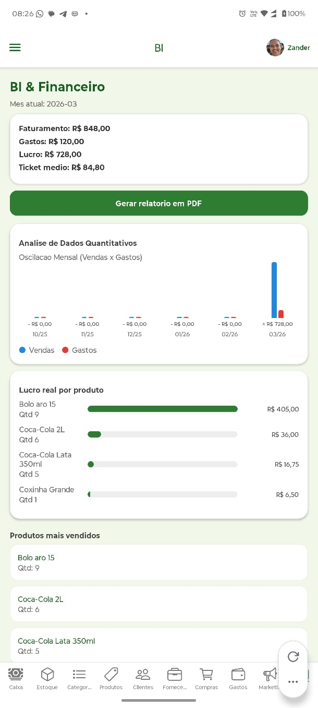 | 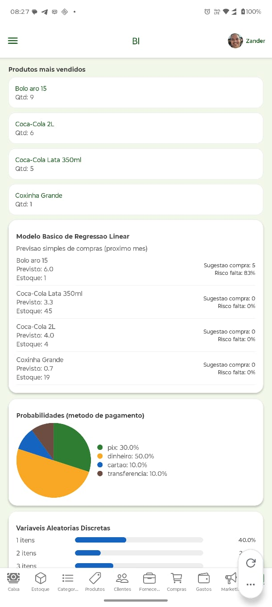 | 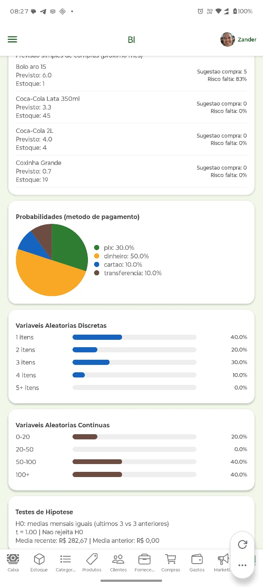 |
| *Cálculo cruzando custo e preço de venda.* | *Previsão de compras com regressão linear.* | *Gráficos de distribuição e tickets.* |

> **Nota:** As imagens acima são ilustrativas do ambiente de homologação. O layout adapta-se automaticamente a diferentes tamanhos de tela de dispositivos Android.

### 🎨 UI/UX e Usabilidade
* **Design system mobile**: Padroniza cards, inputs, botões e tipografia.
* **Layout responsivo**: Ajustes para telas 360–420px.
* **Formulários colapsáveis**: Reduz poluição visual e melhora foco.
* **Busca e filtros**: Facilita encontrar clientes, produtos e fornecedores.

### 👤 Perfil e Conta
* **Avatar com persistência**: Foto salva no backend e sincronizada.
* **Edição de nome**: Atualiza local e online.
* **Câmera e galeria**: Suporte completo para troca de foto.

### 🧱 Marca e Ícones
* **Ícones oficiais**: Splash, favicon e adaptive icon.
* **Versão monochrome**: Compatível com launchers Android.
* **Nome do app**: Padronizado para SweetControl.

### 🧪 Qualidade e Estabilidade
* **Correção de erros 500**: Ajustes de BOM/strict_types no backend.
* **Sincronização robusta**: Fila priorizada por dependência.
* **Testes unitários**: Suite mobile validada.
